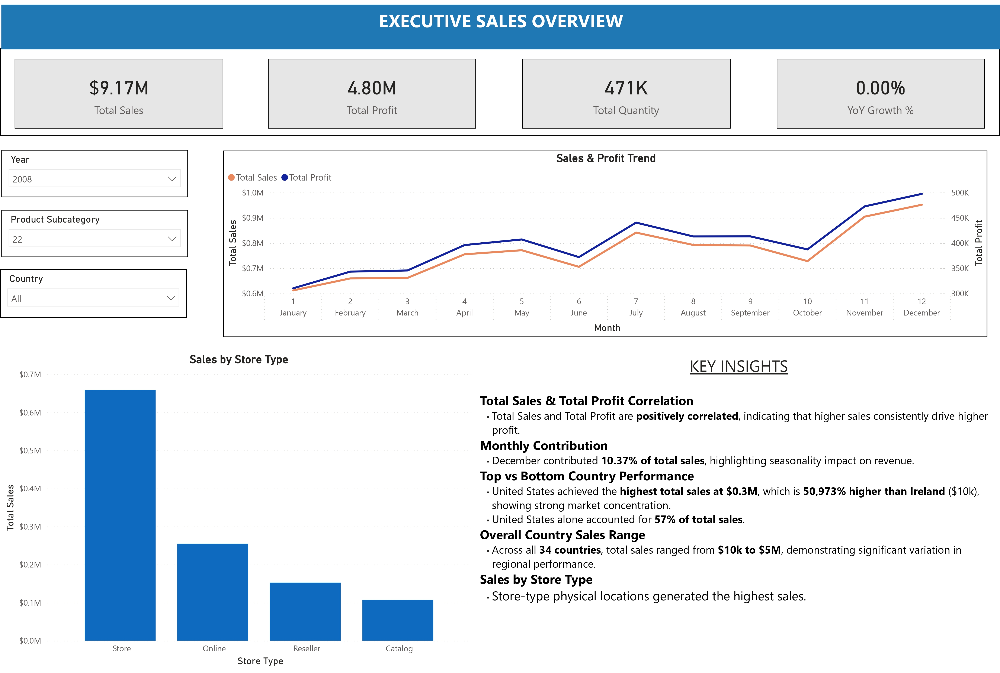
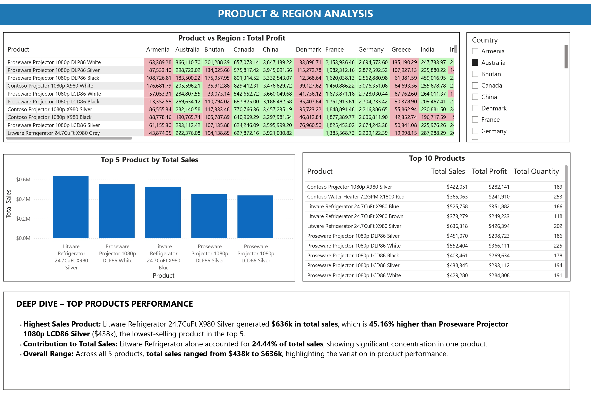
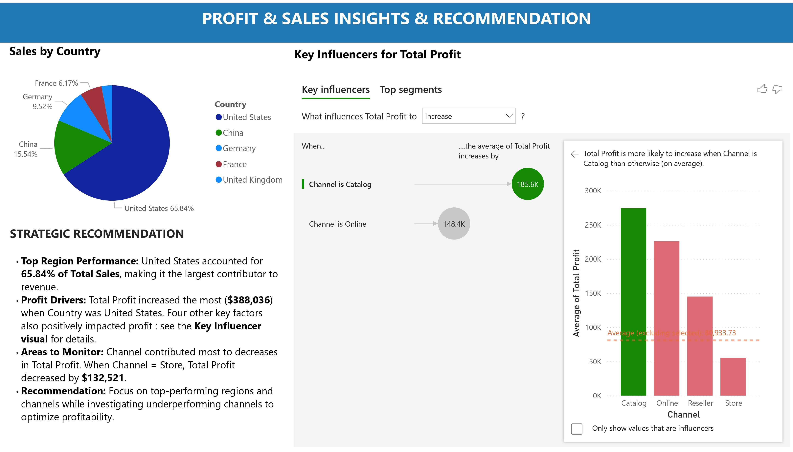

# Sales Performance & Profitability Analysis Dashboard


## 🎯 Business Problem

A retail organization operating across 34 countries needed visibility into sales performance and profitability drivers to optimize revenue growth while improving profit margins. Leadership required an executive-ready analytical solution to identify market opportunities, understand product performance variations, and uncover factors impacting profitability across channels and regions.

---

## 💡 Key Insights

### Revenue Concentration & Seasonality
- **United States dominates revenue**: 57% of total sales ($5M), 50,973% higher than lowest-performing market (Ireland: $10k)
- **December drives year-end performance**: 10.37% of annual sales concentrated in final month
- **Product concentration risk**: Top product (Litware Refrigerator) accounts for 24.44% of total sales

### The Profitability Paradox
- **Physical stores generate highest revenue BUT lowest profit margins**
- Store channel decreased Total Profit by **$132,521** despite driving sales volume
- United States region contributed **$388,036 profit increase** – the single largest profit driver

### Strategic Opportunities Identified
1. Optimize store channel operations to close profit gap without sacrificing revenue
2. Replicate US market success factors in underperforming regions
3. Diversify product revenue mix to reduce concentration risk

---

## 🔧 Technical Approach

### Data Architecture
- **Data Source**: Contoso sample retail dataset
- **Data Model**: Star schema with fact table (Sales) and dimension tables (Products, Stores, Regions, Calendar)
- **Grain**: Individual transaction level
- **Key Relationships**: 
  - Sales ← Products (ProductKey)
  - Sales ← Stores (StoreKey)
  - Sales ← Geography (GeographyKey)
  - Sales ← Date (DateKey)

### Advanced Analytics Features
**DAX Measures Implemented:**
```dax
Total Sales = SUM(Sales[SalesAmount])

Total Profit = 
SUMX(
    Sales,
    Sales[SalesQuantity] * (Sales[UnitPrice] - Sales[UnitCost])
)

Profit Margin % = 
DIVIDE([Total Profit], [Total Sales], 0)

Sales vs LY = 
VAR CurrentSales = [Total Sales]
VAR PreviousYearSales = 
    CALCULATE(
        [Total Sales],
        SAMEPERIODLASTYEAR('Date'[Date])
    )
RETURN
    CurrentSales - PreviousYearSales
```

### Power BI Features Utilized
- **Key Influencers AI visual** for automated profit driver analysis
- **Drill-through pages** for product and regional deep dives
- **Dynamic filtering** across all pages with consistent slicer selection
- **Conditional formatting** to highlight performance outliers
- **Custom tooltips** for contextual metric details

---
## 📸 Dashboard Screenshots
### Page 1 – Executive KPI Overview

*High-level sales and profit metrics with geographic and temporal distribution*

### Page 2 – Product & Regional Deep Dive

*Detailed product performance breakdown and regional comparison*

### Page 3 – Profit Driver Analysis

*AI-powered insights on factors increasing/decreasing profitability*

---

## 💼 Business Impact & Recommendations

### Critical Finding: The Store Channel Profitability Gap

**The Issue:**  
While physical stores drive 57% of total sales, they contribute to a **$132,521 decrease in total profit** compared to other channels. This sales-profit disconnect indicates operational inefficiencies.

**Root Causes Identified:**
- Higher operational and staffing costs at physical locations
- Aggressive promotional discounting to drive store traffic
- Product mix skewed toward lower-margin items

### Strategic Recommendations

**1. Immediate Actions (0-3 months)**
- Conduct store-level P&L analysis to identify highest-cost locations
- Review promotional strategy: test reducing discount depth while maintaining frequency
- Implement margin-weighted sales targets for store managers

**2. Medium-term Optimizations (3-6 months)**
- Pilot premium product placement strategy in top 10 stores
- Renegotiate supplier contracts in US market to improve unit economics
- Launch channel optimization: shift low-margin bulk orders to online/warehouse

**3. Long-term Strategic Shifts (6-12 months)**
- Diversify revenue beyond top product (currently 24% concentration)
- Expand successful US market playbook to Canada and Western Europe
- Build predictive model for seasonality to optimize inventory and staffing for Q4 surge

### Expected Impact
- **15-20% profit margin improvement** in store channel through operational optimization
- **$250k+ annual profit increase** from pricing and product mix refinement
- **Revenue diversification** reducing single-product dependency from 24% to <15%

---

## 📁 Repository Contents
```
BI_Portfolio_Dashboard/
├── README.md (this file)
├── Page1_ExecutiveKPIs.jpg
├── Page2_ProductDeepDive.jpg
├── Page3_KeyInfluencerInsights.jpg
└── Sales Dashboard.pbix 
```

---

## 🔗 How to Embed Power BI Dashboard

**Option 1: Publish to Power BI Service (Free)**
1. Open your .pbix file in Power BI Desktop
2. Click **File → Publish → Publish to Power BI**
3. Sign in with Microsoft account (create free account if needed)
4. Select "My Workspace" as destination
5. Once published, go to powerbi.com
6. Find your report → Click **File → Embed report → Website or portal**
7. Copy the iframe embed code
8. Replace `YOUR_POWERBI_EMBED_LINK_HERE` above with: `<iframe width="100%" height="600" src="YOUR_EMBED_URL" frameborder="0" allowFullScreen="true"></iframe>`

**Option 2: Share Public Link**
- In Power BI Service, click **File → Share → Share with people**
- Enable "Allow recipients to share" for public access
- Copy link and replace placeholder above

---

## 🛠️ Skills Demonstrated

✅ Business Intelligence Strategy  
✅ Executive Dashboard Design  
✅ Advanced DAX (Time Intelligence, Statistical Analysis)  
✅ Data Modeling (Star Schema)  
✅ AI-Powered Analytics (Key Influencers)  
✅ Business Storytelling & Insight Generation  
✅ Strategic Recommendation Development

---

## 📬 Questions or Feedback?

I'm always open to discussing this project in more detail. Feel free to reach out via [LinkedIn](https://www.linkedin.com/in/neema-mv/).

---

*Built with Power BI Desktop | Data: Microsoft Contoso Sample Dataset*
